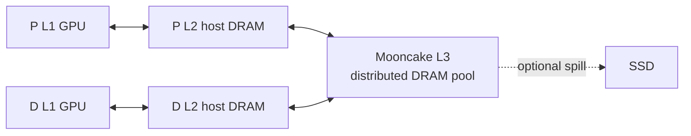

# SGLang PD 分离与 Mooncake KV Cache 池化：当前实现、P/D 读写路径和二次命中行为

> 本文基于 SGLang 当前工作区提交 `03f44c978acb00ae1ca45deb94e71d000c31b183`（2026-08-03）分析。代码仍在快速演进，文中“当前”“默认”均指该提交。

## 1. 先给结论

### 1.1 最重要的结论

1. **`--disaggregation-transfer-backend mooncake` 不等于启用了 Mooncake KV cache 池。**

   这个参数只选择 PD 之间的 Mooncake TransferEngine，把 P GPU 上刚生成或已命中的 KV 直接搬到 D 的目标 KV 地址。它是一条点对点传输链路，不执行 Mooncake Store 的 `Put/Get`，也不形成跨请求持久复用的共享池。

2. **真正的 Mooncake KV cache 池化是 SGLang HiCache 的 L3 backend：**

   ```text
   L1 = 本 SGLang 实例的 GPU HBM/VRAM KV cache
   L2 = 本 SGLang 实例的 host DRAM KV cache
   L3 = Mooncake Store 的分布式 DRAM 池（可选继续 spill 到 SSD）
   ```

   对应的核心参数是：

   ```bash
   --enable-hierarchical-cache
   --hicache-storage-backend mooncake
   ```

3. **P 会不会把 KV cache 存进池？**

   - 只开 PD Mooncake TransferEngine：**不会写 Mooncake Store 池**，只会把 KV 发给 D；P 自己仍可能保留本地 GPU radix cache。
   - P 同时启用 HiCache + Mooncake Store：**会**。P 完成 prefill 后，KV 先进入 P 的 radix/HiCache，按写策略从 GPU 写到 P 的 host DRAM，再写到 Mooncake L3。
   - 当前默认 `--hicache-write-policy` 是 `write_through`；新插入的、按 page 对齐的 KV 会异步写向 L2/L3。若改成 `write_back` 或 `write_through_selective`，写入时机会变化。

4. **D 会不会从池里拉 KV cache？**

   默认不会。当前 D 默认被强制使用 chunk cache，通常直接接收 P 传来的 KV。

   D 只有在同时满足下面条件时，才走完整的 D-side HiCache 读路径：

   ```bash
   --disaggregation-decode-enable-radix-cache
   --enable-hierarchical-cache
   --hicache-storage-backend mooncake
   ```

   此时 D 会先匹配自己的 L1/L2，再查询 Mooncake L3，执行 `L3 -> D host DRAM -> D GPU` 的恢复，并把自己的命中前缀长度告诉 P，使 P 不再向 D 重传这部分 KV。

5. **`--disaggregation-decode-enable-offload-kvcache` 是 D 写池能力，不是 D 读池能力。**

   该开关启动一个独立的 `DecodeKVCacheOffloadManager`，把 decode 阶段新增的、按 stride/page 对齐的 KV 异步执行：

   ```text
   D GPU -> D 临时 host pool -> Mooncake L3
   ```

   仅打开这个开关时，D 负责“贡献 decode 增量 KV”，但后续请求仍主要由 **P 从共享池读取**，然后再通过 PD TransferEngine 把需要的 KV 发送给 D。

6. **目前主流/文档推荐的 PD + 池化方式下，第二次请求主要是 P 从池里拉。**

   当前 `hicache_best_practices.mdx` 推荐的是：

   - P：完整启用 HiCache，负责从 L3 读取共享前缀；
   - D：启用 async decode offload，负责把多轮对话中新生成的 decode KV 写入 L3；
   - 下一轮：P 读取上轮由 P/D 合作写入的完整上下文 KV，再向 D 传输。

   但当前代码已经支持另一种更新的实验性模式：D 也启用 radix + 完整 HiCache。此时第二次请求不是简单的“只由 P 拉”或“只由 D 拉”，而是 **P、D 各自为自己的 GPU 执行 L3 恢复**；D 会把自己的命中长度反馈给 P，从而省掉相同前缀的 `P -> D` 传输。

7. **D decode 完成后会不会把 KV cache 贡献给池？**

   - 默认 D：**不会**。
   - D 开启 `--disaggregation-decode-enable-offload-kvcache`：**会写 decode 增量 KV**。
   - D 开启 decode radix + 完整 HiCache：请求完成走标准 radix/HiCache 插入和写回，**会把 page 对齐的已提交 prompt + decode KV 写入 L3**，具体时机受 `hicache_write_policy` 控制。

## 2. 必须区分的两个 “Mooncake”

### 2.1 Mooncake TransferEngine：PD 点对点传输

这是 `--disaggregation-transfer-backend mooncake` 对应的组件。


其特点是：

- 源和目标都是已注册的 KV buffer 地址；
- D 先分配目标 page，并将目标指针/索引发给 P；
- P 调用 TransferEngine 把数据直接写到 D；
- 传输完成后，这条请求结束；它本身没有跨请求对象生命周期、内容 hash、L3 淘汰或 Store master。

关键代码：

- P 发起请求级 KV 发送：[`prefill.py`](../python/sglang/srt/disaggregation/prefill.py)，`send_kv_chunk()`，当前约 1106-1252 行；
- Mooncake sender 入传输队列：[`conn.py`](../python/sglang/srt/disaggregation/mooncake/conn.py)，`MooncakeKVSender.send()`，当前约 2094-2150 行；
- 真正的地址到地址传输：同文件 `MooncakeKVManager._transfer_data()`，当前约 610-617 行，调用 `engine.batch_transfer_sync(...)`；
- D 把目标地址和命中长度发给 P：同文件 `MooncakeKVReceiver.send_metadata()`，当前约 2299-2350 行。

### 2.2 Mooncake Store：HiCache L3 共享对象池

这是 `--hicache-storage-backend mooncake` 对应的组件。



其特点是：

- KV page 以内容前缀 hash 为 key；
- 可跨请求、跨 SGLang 实例共享；
- Mooncake master 管理对象放置、容量和淘汰；
- SGLang 的 Mooncake backend 使用 host KV pool 的指针执行 zero-copy `batch_get_v1/batch_set_v1`；
- `global_segment_size` 表示实例向 Mooncake 全局池贡献的内存容量，默认语义是 **DRAM segment**；
- 可由独立、无 GPU 的 store service 提供 DRAM；SGLang 实例也可在进程内贡献 DRAM；
- 开启 SSD offload 后，DRAM 不够时可继续使用 SSD，但 SSD 是更低一层的扩展，不改变 L3 的常规 DRAM 池属性。

关键代码：

- backend 注册：[`backend_factory.py`](../python/sglang/srt/mem_cache/storage/backend_factory.py)，当前约 196-211 行；
- Mooncake Store 初始化和 `global_segment_size`：[`mooncake_store.py`](../python/sglang/srt/mem_cache/storage/mooncake_store/mooncake_store.py)，`MooncakeStore.__init__()`，当前约 380-547 行；
- L3 读取：同文件 `batch_get_v1()`，当前约 1030-1057 行；
- L3 写入：同文件 `batch_set_v1()`，当前约 1059-1115 行；
- SGLang 自带说明也明确称其为 “high-speed interconnected DRAM/SSD resources”：[`Mooncake Store README`](../python/sglang/srt/mem_cache/storage/mooncake_store/README.md)，当前约 12-30、74-183 行。

### 2.3 为什么“支持 GPUDirect”仍不等于“GPU 池化”

这里要区分“数据传输终点可以是 GPU”与“共享容量由 GPU HBM 贡献”两个概念：

- PD TransferEngine 能够通过 GPUDirect RDMA/NVLink 把 P GPU 数据直接写入 D GPU；
- Mooncake Store 也能使用 RDMA/zero-copy 高效访问已注册 buffer；
- 但在 SGLang HiCache 集成中，Mooncake Store backend 注册的是 `mem_pool_host`，L3 全局 segment 通常来自 CPU DRAM；
- 每个 P/D 实例自己的 GPU KV pool 仍然是私有 L1，并没有被聚合成一个由所有 GPU HBM 共同组成、任意实例可直接寻址的全局 HBM 池。

因此，针对本文场景最准确的回答是：**Mooncake 的 KV cache 池化主要是 DRAM 层级的分布式 L3 池化，可选 SSD 扩展；GPU 是私有 L1 和高性能传输端点，不是当前 SGLang + Mooncake HiCache 的共享容量主体。**

## 3. 基础 PD 请求链路

一次普通 PD 请求的核心过程如下：

1. Router 为同一请求协调一个 P 和一个 D。
2. D 在自己的 KV pool 中预分配目标页。
3. D 把目标 KV page 索引/地址发给 P。
4. P 执行 prompt prefill，产生输入 token 的 KV 和首个输出 token。
5. P 通过 PD Mooncake TransferEngine 将 prompt KV 写入 D 的目标页。
6. D 等待传输完成后继续 decode。

当前代码对 D 默认行为的定义很直接：

- [`pd_disaggregation_hook.py`](../python/sglang/srt/arg_groups/pd_disaggregation_hook.py) 当前约 55-84 行：如果没有 `--disaggregation-decode-enable-radix-cache`，D 会被强制设置为 chunk cache；
- [`decode.py`](../python/sglang/srt/disaggregation/decode.py) 当前约 1013-1046 行：只有 decode radix 开启时，D 才会执行前缀匹配；否则 `prefix_len = 0`、`total_prefix_len = 0`；
- [`prefill.py`](../python/sglang/srt/disaggregation/prefill.py) 当前约 326-342 行：P 从 D 收到 `decode_prefix_len`，并设置 `req.start_send_idx`；
- 同文件 `send_kv_chunk()` 只发送 `[start_send_idx, end_idx)`，所以 D 已拥有的前缀不会再从 P 重传。

## 4. 三种主要部署组合

### 4.1 组合 A：只有 PD Mooncake TransferEngine，没有共享池

示意参数：

```bash
# P 与 D 都有
--disaggregation-transfer-backend mooncake

# 没有
--enable-hierarchical-cache
--hicache-storage-backend mooncake
```

行为：

- P 可使用自己进程内的 GPU radix cache；
- P 不会调用 Mooncake Store `Put`；
- D 默认没有 radix cache，不能跨请求保留/匹配前缀；
- 每个请求需要的 KV 仍由 P 通过 TransferEngine 发给 D；
- 这里没有用户通常所说的“全局 KV cache 池化”。

### 4.2 组合 B：P 完整 HiCache，D 只做 async decode offload

这是当前官方 best-practices 文档重点推荐的 PD + 池化形态。

P 侧：

```bash
--disaggregation-mode prefill
--disaggregation-transfer-backend mooncake
--enable-hierarchical-cache
--hicache-storage-backend mooncake
--hicache-write-policy write_through
```

D 侧：

```bash
--disaggregation-mode decode
--disaggregation-transfer-backend mooncake
--hicache-storage-backend mooncake
--disaggregation-decode-enable-offload-kvcache
```

行为：

- P 首轮将 page 对齐的 prompt KV 写入 L3；
- D 在生成过程中把新增的 decode KV 按对齐 stride 异步写入同一个 L3；
- 下一轮多轮对话请求包含“旧 prompt + 旧 answer + 新问题”时，P 可从 L3 命中更长的历史；
- D 没有开启完整 HiCache 读路径，仍由 P 传入所需 KV；
- 所以这个组合下，**二次命中的主要读取者是 P，D 是 decode 增量的生产者/写入者。**

仓库文档对此也有明确表述：[`hicache_best_practices.mdx`](../docs/docs/advanced_features/hicache_best_practices.mdx) 当前约 73-123 行，将其描述为 “Prefill nodes reuse KV caches from Decode nodes”。

### 4.3 组合 C：P 和 D 都启用完整 HiCache，D 自己从 L3 拉

P 侧仍然完整启用 HiCache。D 侧至少需要：

```bash
--disaggregation-mode decode
--disaggregation-decode-enable-radix-cache
--enable-hierarchical-cache
--hicache-storage-backend mooncake
```

行为：

1. D 在收到新请求时先查自己的 L1/L2 radix/HiCache；
2. 对 L1/L2 未覆盖的连续前缀，D 查询 Mooncake L3；
3. 命中超过门槛后，D 发起 `L3 -> D L2` prefetch；
4. 再发起 `D L2 -> D L1` load-back；
5. D 将 `L1 + L2 + L3` 的总命中长度作为 `decode_prefix_len` 发给 P；
6. P 只向 D 发送该长度之后的 delta KV；
7. P 为了完成自己的 prefill/首 token 计算，仍会独立使用自己的 L1/L2/L3。因此在 P 本地也 miss 时，P 也可能从同一 L3 拉一次自己的副本。

因此这个模式下要分两个问题回答：

- “D 需要的缓存从哪里来？”——命中部分由 **D 直接从池恢复**，不再经过 P；
- “整个请求谁会读池？”——**P 和 D 都可能读**，因为两边各自要在本地 GPU 上拥有执行所需的 KV。

D-side L3 恢复的端到端测试见 [`test_disaggregation_decode_radix_cache.py`](../test/registered/disaggregation/test_disaggregation_decode_radix_cache.py) 当前约 157-265 行。测试同时刷新 P/D 内存 cache，再验证后续轮次可从 L3 复用包含 decode 输出的历史。

## 5. 第二次请求命中时，到底是 P 拉还是 D 拉

不能脱离启动参数给唯一答案。当前代码对应关系如下：

| 部署配置 | P 从 L3 拉 | D 从 L3 拉 | P -> D 传输 | 当前定位 |
|---|---:|---:|---|---|
| 仅 PD TransferEngine | 否 | 否 | 发送 D 不具备的全部 KV | 纯 PD，无共享池 |
| P 启用完整 HiCache，D 默认 | 是 | 否 | P 命中/计算后仍把 KV 发给 D | P-only HiCache |
| P 完整 HiCache + D async offload | 是 | 否 | P 把下一轮所需 KV 发给 D | 当前 best-practices 主路径 |
| P/D 都完整 HiCache，D decode radix 开启 | 是，若 P L1/L2 miss | 是，若 D L1/L2 miss | 只发送 D 未命中的 delta | 当前已有实现和测试，D radix 标记为 experimental |

还应注意三个细节：

1. 默认 L3 prefetch threshold 是 256 tokens；比门槛更短的 L3 hit 不会触发 prefetch。
2. `cached_tokens` 统计和“网络上是谁拉了多少字节”不是完全同一个概念；P/D 各自可能有 L1、L2、L3 命中。
3. 即使 D 已经完整命中而让 P 不再向 D 传这部分 KV，P 通常仍要在自己的执行侧获取必要 KV，以完成 prefill 边界处的注意力和首 token 计算。

## 6. P 写池和拉池的具体代码

### 6.1 P 收到请求后发起 L3 prefetch

入口在 [`scheduler.py`](../python/sglang/srt/managers/scheduler.py)：

- `_add_request_to_queue()` 当前约 2572-2586 行：P 模式先调用 `_prefetch_kvcache(req)`；
- `_prefetch_kvcache()` 当前约 2547-2570 行：执行本地 match，然后调用 `tree_cache.prefetch_from_storage(...)`；
- 调度前当前约 3161-3170 行等待/检查 prefetch 进度；
- 当前约 3250-3254 行通过 `ready_to_load_host_cache()` 启动 host-to-device load-back。

### 6.2 L3 查询、读取到 L2、再加载到 GPU

在 [`hiradix_cache.py`](../python/sglang/srt/mem_cache/hiradix_cache.py)：

- `match_prefix()`，当前约 1706-1737 行：返回 L1 device hit 和 L2 host hit；
- `prefetch_from_storage()`，当前约 1739-1778 行：将 L3 prefetch 交给 controller；
- `init_load_back()` / `load_back()`，当前约 1340-1433 行：把 L2 host cache 恢复到 L1 GPU；
- `ready_to_load_host_cache()`，当前约 1479-1484 行：启动实际 H2D 加载。

在 [`cache_controller.py`](../python/sglang/srt/managers/cache_controller.py)：

- `_storage_hit_query()`，当前约 1023-1045 行：按 page hash 查询 L3 连续命中；
- `_page_get_zero_copy()`，当前约 927-941 行：调用 backend `batch_get_v1()`，将 L3 内容直接写到 host pool；
- `HiCacheController.load()`，当前约 743-758 行：分配 GPU page 并排队 L2 -> L1；
- `start_loading()` 负责合并并启动传输。

Mooncake backend 的最终读调用在 [`mooncake_store.py`](../python/sglang/srt/mem_cache/storage/mooncake_store/mooncake_store.py)：

- `batch_get_v1()` 当前约 1030-1057 行；
- 它构造 host page 的地址/大小，并调用 `_get_batch_zero_copy_impl(...)`。

### 6.3 P 完成 prefill 后写入 L3

PD P 完成 prefill 后在 [`prefill.py`](../python/sglang/srt/disaggregation/prefill.py) 当前约 697-746 行调用 `maybe_cache_unfinished_req(req, self.tree_cache)`，把本次已产生的 KV 插入 radix/HiCache。

随后写链路为：

1. [`radix_cache.py`](../python/sglang/srt/mem_cache/radix_cache.py) `cache_unfinished_req()`，当前约 488-553 行；
2. [`hiradix_cache.py`](../python/sglang/srt/mem_cache/hiradix_cache.py) `insert()`，当前约 1880-1962 行；
3. 同文件 `_inc_hit_count()` / `write_backup()`，当前约 840-870、977-987 行，触发 GPU -> host；
4. 同文件 `_finish_write_through_ack()` / `write_backup_storage()`，当前约 904-940 行，触发 host -> L3；
5. [`cache_controller.py`](../python/sglang/srt/managers/cache_controller.py) `write_storage()` 与 `_page_backup()`，当前约 1090-1104、1186-1210 行；
6. [`mooncake_store.py`](../python/sglang/srt/mem_cache/storage/mooncake_store/mooncake_store.py) `batch_set_v1()`，当前约 1059-1115 行，最终执行 Mooncake zero-copy Put。

## 7. D 拉池的具体代码

D 完整拉池能力由下面这个布尔条件控制：

[`scheduler.py`](../python/sglang/srt/managers/scheduler.py) 当前约 413-419 行：

```python
self.enable_decode_hicache = (
    server_args.disaggregation_decode_enable_radix_cache
    and self.enable_hierarchical_cache
)
```

也就是说，仅配置 `--hicache-storage-backend mooncake`，或仅配置 decode offload，都不会自动打开 D 的读池路径。

D 的具体链路是：

1. [`decode.py`](../python/sglang/srt/disaggregation/decode.py) `DecodePreallocQueue.pop_preallocated()` 当前约 1013-1027 行：D 匹配 radix/HiCache，计算 L1、L2、L3 总命中；
2. 同文件当前约 1102-1110 行：完成预分配后调用 `_start_hicache_prefetch()`；
3. [`decode_hicache_mixin.py`](../python/sglang/srt/disaggregation/decode_hicache_mixin.py) `_build_decode_prefix_match()` 当前约 61-99 行：调用 `query_storage_hit_length()` 查询 L3；
4. 同文件 `_start_hicache_prefetch()` 当前约 101-139 行：触发 L3 -> L2；
5. 同文件 `_try_hicache_queue_load_back()` 当前约 183-240 行：等待 prefetch 完成、重新 match、调用 `init_load_back()` 触发 L2 -> L1；
6. 同文件 `_commit_hicache_local_restore_to_req()` 当前约 294-311 行：把恢复后的 GPU indices 写入 D 的 `req_to_token_pool`；
7. [`decode.py`](../python/sglang/srt/disaggregation/decode.py) 当前约 1946-2052 行：在 D 的本地恢复完成前，即使 P -> D 的 delta 已经到达，也不会将请求放入 decode 执行；
8. 同文件当前约 1126-1143 行：D 只给 P 分配/发送 `total_prefix_len` 之后的目标 indices。

D 把命中长度通知 P 的协议字段是 `decode_prefix_len`：

- D 发出：[`mooncake/conn.py`](../python/sglang/srt/disaggregation/mooncake/conn.py) `MooncakeKVReceiver.send_metadata()` 当前约 2299-2350 行；
- P 接收并设置发送起点：[`prefill.py`](../python/sglang/srt/disaggregation/prefill.py) `finalize_bootstrap()` 当前约 326-342 行。

## 8. D decode 完成后写池的两条代码路径

### 8.1 路径一：专用 async decode offload

启用：

```bash
--disaggregation-decode-enable-offload-kvcache
--hicache-storage-backend mooncake
```

初始化在 [`scheduler.py`](../python/sglang/srt/managers/scheduler.py) 当前约 546-562 行，创建 `DecodeKVCacheOffloadManager`。

运行时入口在 [`batch_result_processor.py`](../python/sglang/srt/managers/scheduler_components/batch_result_processor.py)：

- 当前约 1020-1024 行：请求尚未结束时尝试分段 offload；
- 当前约 1041-1044 行：请求结束时 offload 最后一段可对齐部分，再延迟释放 KV。

核心实现在 [`decode_kvcache_offload_manager.py`](../python/sglang/srt/disaggregation/decode_kvcache_offload_manager.py)：

- `offload_kv_cache()` 当前约 129-203 行；
- 当前 142-175 行明确区分 P 已 offload 的 page-aligned prompt 与 D 新增的 incremental tokens；
- 当前 182-188 行执行 D GPU -> host；
- `_check_offload_progress()` 当前约 225-255 行在 D2H 完成后触发 storage backup；
- `_trigger_backup()` 当前约 316-327 行调用 `cache_controller.write_storage(...)`，即 host -> Mooncake L3。

这条路径的边界条件：

- `all_tokens = origin_input_ids + output_ids[:-1]`，最后一个尚未形成可用 KV 的 token 不写；
- 只写满 `offload_stride` 的部分，默认 stride 至少为一个 page；
- 尾部不足一个 stride/page 的 KV 不会形成独立 L3 page；
- 该 manager 主要写 D 增量，不负责 D-side L3 查询和恢复。

### 8.2 路径二：D 完整 radix + HiCache 的标准写回

若 D 启用了：

```bash
--disaggregation-decode-enable-radix-cache
--enable-hierarchical-cache
--hicache-storage-backend mooncake
```

且没有由专用 offload 路径接管完成释放，那么请求完成时 [`batch_result_processor.py`](../python/sglang/srt/managers/scheduler_components/batch_result_processor.py) 当前约 1045-1058 行调用 `release_kv_cache(req, tree_cache)`。

标准链路为：

1. [`mem_cache/common.py`](../python/sglang/srt/mem_cache/common.py) `release_kv_cache()` 当前约 132-175 行；
2. [`radix_cache.py`](../python/sglang/srt/mem_cache/radix_cache.py) `cache_finished_req()` 当前约 434-486 行，构造 `origin_input_ids + output_ids` 的 page-aligned key/value；
3. [`hiradix_cache.py`](../python/sglang/srt/mem_cache/hiradix_cache.py) `insert()` 和标准 write-through/write-back 链路；
4. 最终进入 Mooncake `batch_set_v1()`。

因此，D 完整 HiCache 模式不仅能读 L3，也能在 decode 完成后把新的、更长前缀贡献给 L3。仓库注册测试 [`test_disaggregation_decode_radix_cache.py`](../test/registered/disaggregation/test_disaggregation_decode_radix_cache.py) 当前约 233-265 行专门验证了：刷新 P/D 内存 cache 后，下一轮仍能从 L3 复用包含上轮 decode 输出的上下文。

## 9. 当前能力状态与限制

### 9.1 已经具备的能力

- P-side HiCache + Mooncake L3 的读写；
- D -> L3 的异步 decode 增量 offload；
- D-side radix cache；
- D-side 完整 L1/L2/L3 查询、prefetch、load-back；
- D 将完整命中长度反馈给 P，P 仅发送 delta；
- D 完成后通过标准 HiCache 写回完整的 page-aligned 已提交上下文；
- Mooncake L3 的分布式 DRAM 池、跨实例共享、可选 SSD offload；
- Mooncake PD TransferEngine 的 RDMA/NVLink/TCP 直传。

### 9.2 D-side radix/HiCache 仍是实验性能力

[`pd_disaggregation_hook.py`](../python/sglang/srt/arg_groups/pd_disaggregation_hook.py) 当前约 55-84 行会打印 `EXPERIMENTAL: Radix cache is enabled for decode server`，并限制：

- 与 `--enable-hisparse` 不兼容；
- 与 fake PD transfer backend 不兼容；
- 与 speculative decoding 不兼容；
- PD decode 的 DCP `> 1` 当前要求 chunk cache，因此不支持 decode radix/完整 D-side HiCache。

### 9.3 共享池正确命中的前提

P、D 或多个 P/D 实例要共享同一批 KV，至少要保证：

- 相同模型权重/版本和兼容的 served model namespace；
- 相同 token 序列与影响 KV 的 extra key；
- 相同 page size；
- 兼容的 KV dtype、attention/KV layout；
- TP/PP/CP 分片的 key 后缀和布局兼容；异构 TP 的 MHA 场景需按代码支持方式配置 `tp_lcm_size`/`page_head`；
- 指向同一个 Mooncake master/Store 集群，并使用一致的 `tenant_id`、model prefix 和额外 backend tag；
- 写入已异步完成；否则紧接着发起的下一请求可能暂时查不到最新 page。

## 10. 推荐如何理解和选择

### 10.1 主要目标是 system prompt/RAG 前缀跨 P 共享

只在 P 上启用完整 HiCache + Mooncake Store 即可。第二次命中由 P 拉，P 再把 KV 发给 D。部署简单，D 保持默认 chunk cache。

### 10.2 主要目标是多轮对话复用 D 生成的历史

使用当前 best-practices 组合：P 完整 HiCache + D async decode offload。D 负责把回答部分写入 L3，下一轮 P 拉取完整历史。这也是回答“第二次请求主要谁拉”的默认推荐答案：**P 拉。**

### 10.3 目标是同时减少 P -> D KV 网络传输

在确认模型/并行配置受支持后，让 D 启用 decode radix + 完整 HiCache。此时 D 自己拉命中 KV，并告诉 P 只发 delta。代价是 P/D 可能各自从 L3 读取自己的副本，且 D-side 能力当前仍标记为 experimental。

## 11. 一句话总结

**当前 SGLang + Mooncake 中，PD Mooncake 是 GPU 间传输通道，HiCache Mooncake Store 才是以分布式 DRAM 为主的 KV cache 池；主流 PD 池化方案是 P 从池读取、D 把 decode 增量贡献回池，而新实现已允许 D 自己从池读取并通过 `decode_prefix_len` 让 P 只发送未命中的 KV delta。**
